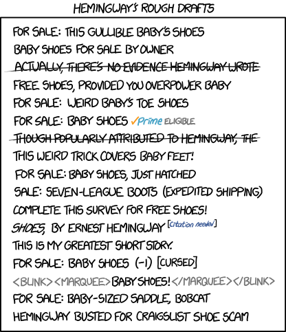

# mcubed
Flask app using scrapy (with celery) and cortipy for fingerprinting.

How do I use it? Is it tested? Is it fast? Is the fingerprinting good?

All these and more, next time! Consider this a rough draft.

